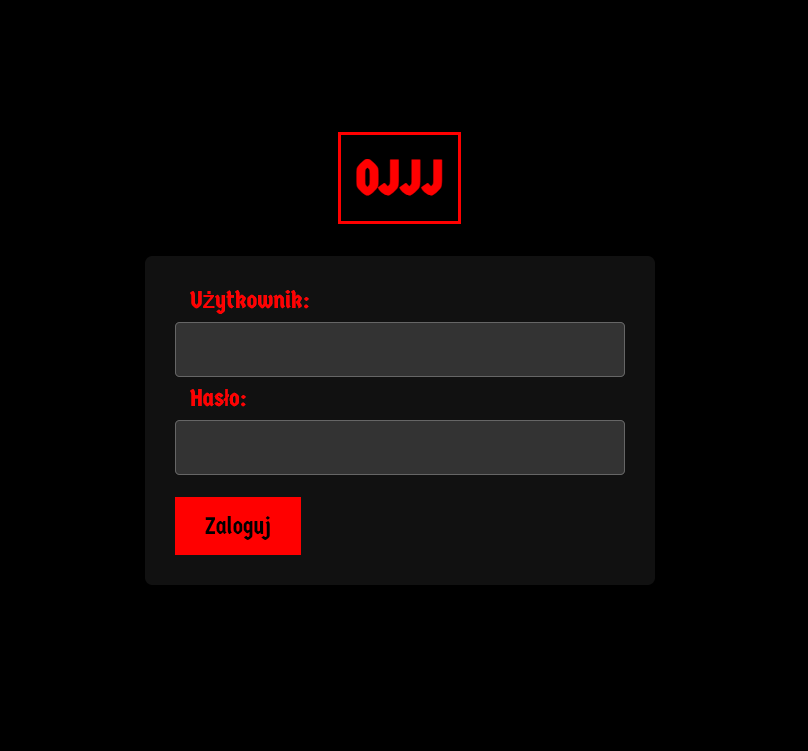
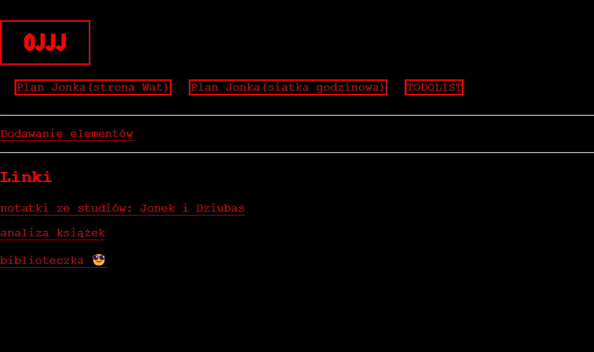

# OJJJ
Quick little project they said....
OJJJ is a website me and my girlfriend created to share educational resources with each other. Links, files, photos and many others in the future. 

It is also a great project for our education - it was built with Django framework which we totally didn't (and objectively still don't - it's only one project) know how to use.

# Two main HTML pages
The site is currently on hosted on Pythonanywhere: janjon12.pythonanywhere.com, but don't bother going in there - it is password protected :D

Login page:

Site with all the good stuff:
